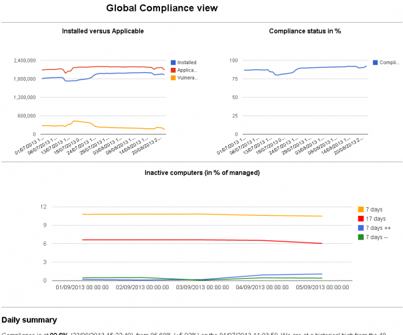

# SiteBuilder

## Features
The Patch Trending site builder generates static web-site to visualize Patch Compliance Trending Data stored on a Symantec_CMDB database. It has the the following attributes:

- A landing page showing:
  - global compliance graphs
  - a bulletin search function
  - link to custom compliance views
- a dynamic page (html + javascript) to quickly access compliance per bulletin
- static pages to show updates details per bulletins
- Custom compliance view, which is a set fully custom pages to show groups of bulletins graphs
- Troubleshooting pages showing "bottom-10-compliance" by bulletin and "top-10-vulnerable" bulletins, and (from v10) 2 pages to show top 10 movers (by installed count i.e up and vulnerable count i.e. down).

## Prerequisites
There are no SQL prerequisites anymore. Run `PatchTrending-8.1.exe /install` to install the required stored procedure.

Run `patchtrending-8.1.exe /collectdata` to collect the data. This is the command that should be run daily.

## Usage
Here is the complete list of valid invocations. For additional details please check the command line help message below or via `patchtrending-81. /?`.

```
sitebuilder
patchtrending-8.1 /?
patchtrending-8.1 /install
patchtrending-8.1 /upgrade
patchtrending-8.1 /version
patchtrending-8.1 /write-all
patchtrending-8.1 /collectdata
patchtrending-8.1 /buildsite
```

The site layout file format use comma separated value (with or without spaces) with the first entry being the page name and following entries being bulletins to be added on the page. If the bulletin name is invalid no page will be generated.

A sample site-layout page is attached with the executables zip.

Here is the command line help message:

<!-- <details>
 <summary>Switches</summary>
 <pre>
 /buildsite
 </pre>
</details> -->

```
Welcome to the Patch Trending SiteBuilder. Here are the currently supported
command line arguments:

    /buildsite
    
        This option is required if you want the tool to output the Patch 
        Trending site, based on the SiteConfig.txt file.

    /collectdata
    
        Run the trending procedure for each site that is enabled on the
        siteconfig.txt.
    
    /collectionguid=
    
        When this option is used the Patch Trending site will be generated for
        the provided collection guid.

    /install

        This command line installs the pre-requisite stored procedures to the
        Symantec CMDB and terminates.

    /upgrade

        Upgrade the database objects and _data_ from the previous schema to the
        latest version which adds a CollectionGuid in various location.

    /write-all

        This command line will prevent static html and css  files from being 
        written to disk. This allows you to customise the site look and feel
        to better suit your needs.
        

    /? || /help

        This command line prints out this help message and terminates.

    /version

Configuration files names and content:

    SiteConfig.txt:
    
        The site config file contains a a list of line seperated sites that
        should be built upon /buildsite invocations, or for which data will be 
        collected upon /collectdata invocations.
        
        The root site is created under the working directory, whilst other
        sites will be created in a directory named using the site-name field.
        
        Here's a sample file with explanation of each fields:
        
# Lines started with # are not process
#
# Fields descripitions:
# enabled (1 | 0), collectionguid, site-name (comma not allowed), site-description, root-site (only one allowed)
#

1, 01024956-1000-4cdb-b452-7db0cff541b6, AllComputers2, All computers with the Software Update plugin installed, 1
1, 01024956-1000-4cdb-b452-7db0cff541b6, AllComputers, All computers with the Software Update plugin installed, 0
1, b677c36f-8cf8-4c57-aa6f-f11948e128c7, Windows-Servers, All windows servers, 0
1, 66167acf-2484-4244-92fb-a2ffaa5aebd2, Windows-Desktops, All Windows Desktops, 0
0, 3faa8b67-250b-42ad-8186-fe2f49a9e707, Windows-64-bit, All Windows 64-bit systems, 0
1, 8afb27a1-5dc7-43ca-a88c-8391252f5b7b, Windows-32-bit, All Windows 32-bit systems, 0
    
    SiteLayout.txt:

microsoft-2015-april, ms15-031, ms15-032, ms15-033, ms15-034, ms15-035, ms15-036, ms15-037, ms15-038, ms15-039, ms15-040, ms15-041, ms15-042
microsoft-2015-march, ms15-018, ms15-019, ms15-020, ms15-021, ms15-022, ms15-023, ms15-024, ms15-025, ms15-026, ms15-027, ms15-028, ms15-029, ms15-030
microsoft-2015-february, ms15-009, ms15-010, ms15-011, ms15-012, ms15-013, ms15-014, ms15-015, ms15-016, ms15-017
microsoft-2015-january, ms15-001, ms15-002, ms15-003, ms15-004, ms15-006, ms15-007, ms15-008
microsoft-2014-december, ms14-080, ms14-081, ms14-082, ms14-083, ms14-084, ms14-085, ms14-086, ms14-087, ms14-088, ms14-089, ms14-090, ms14-091, ms14-092, ms14-093, ms14-094, ms14-095, ms14-096, ms14-097, ms14-098, ms14-099
microsoft-2014-november, ms14-064, ms14-065, ms14-066, ms14-067, ms14-068, ms14-069, ms14-070, ms14-071, ms14-072, ms14-073, ms14-074, ms14-075, ms14-078, ms14-079
microsoft-2014-october, ms14-056, ms14-057, ms14-058, ms14-059, ms14-060, ms14-061, ms14-062, ms14-063
microsoft-2014-september, ms14-052, ms14-053, ms14-054, ms14-055
```

## Screenshots
Note that you are more than welcome to submit sample data to be included on this page on on the mini-site. This would allow us to spotlight standard trends and how well the software performance (Patch Management Solution) in certain environments. If you want to submit data, please send a direct message to Ludovic Ferre on Symantec Connect or email me (ludovic underscore ferre at symantec.com).

***Note!*** The below sample is an image - but the tool mini-site contains live graphs (using the google API and Javascript) and a complete sample site: 

The landing page (1): global compliance + compliance by computer


The landing page (2): global compliance + inactive computers



The landing page (3): global compliance + compliance by computer + inactive computers


Global view (1):


Global view (2):


Global view (3):


Bulletin view:


Updates per bulletin view:


---

{CWoc} Patch Trending SiteBuilder
[https://www.symantec.com/connect/downloads/cwoc-patch-trending-sitebuilder](https://www.symantec.com/connect/downloads/cwoc-patch-trending-sitebuilder)